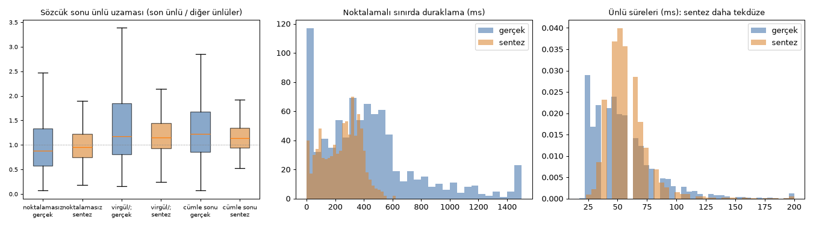

# Ezgi ve akustik karşılaştırma: gerçek Antalia kaydı ile v3a sentezi (2026-09-26)

**Soru (kullanıcı):** v3a sentezinde "her sözcük ayrı bir kayıt gibi" duyuluyor. Neden? Ezgi (F0, perde vurguları), enerji, spektral eğim, formantlar ve ritim bakımından gerçek konuşmadan nerede ayrışıyor?

**Veri:** Eğitimde görülmeyen 143 Antalia test+val cümlesi. Her cümle için gerçek kayıt ve v3a (`v3a_g2ptts_nb_ep150`) sentezi karşılaştırıldı; sentez değerlendirme sırasında üretilen ses (tohum 0, sıcaklık 0,667).
**Kod:** `python -X utf8 -m dizgetts.eval.prosody_acoustics --stage align|report` (ham sonuç: `D:/dizgetts/eval_out/v3a_g2ptts_nb_ep150_x543/prosody/`).

## Yöntem

İki kaynağa aynı işlem uygulandı, böylece yöntemden gelen bir yanlılık iki tarafı eşit etkiler.

- **Hizalama:** v3a'nın kendi Matcha MAS hizalaması kullanıldı. Model Antalia sesini tanıdığı için gerçek kaydı da hizalayabiliyor. Hizalama fonem düzeyinde ve manifest token'larıyla yapıldı. Hizalamada ayrı bir sessizlik token'ı olmadığından sessizlik komşu foneme yükleniyor; bu yüzden duraklamalar, sözcüğün son ünlüsünden bir sonraki sözcüğün ilk ünlüsüne kadar olan bölgede enerji eşiğiyle ölçüldü.
- **add_blank boşlukları:** Matcha fonemlerin arasına boşluk token'ları koyuyor ve bunlara kare ayırıyor. Bu kareler iki komşu foneme yarı yarıya dağıtıldı. **İlk sürümde bu yapılmamıştı**; ünlüler 1–2 kareye (12–23 ms) iniyordu ve spektral eğimde anlamlı görünen fark bu hatadan kaynaklanıyordu. Düzeltmeden sonra ünlü medyanı gerçek kayıtta 46 ms, sentezde 58 ms.
- **F0:** Praat AC. Konuşmacıya uyarlı aralık kullanıldı (Hirst): gerçek kayıtlardan medyan 109 Hz, aralık 66–227 Hz. Değerler yarım ton olarak, konuşmacı medyanına göre verildi.
- **Enerji:** Praat yoğunluğu. Gerçek kayıtlar ön işlemede LUFS −23'e getirilmişti; sentez de aynı düzeye getirildi. Yine de yalnız göreli (cümle içi) farklar kullanıldı.
- **Spektral eğim:** ünlü başına 0–1 kHz ile 1–4 kHz bant enerjisi farkı (alfa oranı).
- **Formantlar:** Burg, ünlü ortasında F1/F2, Bark ölçeğinde.
- **İstatistik:** Klip düzeyinde eşleşmiş fark, klip bootstrap (2000 örnek), %95 güven aralığı.

**Doğrulamalar (hepsi geçti):**

| # | Denetim | Sonuç |
|---|---|---|
| D1 | Sentezde kullanılan token'lar manifestle aynı | 143/143 |
| D2 | Hizalanan kare toplamı mel uzunluğuyla aynı | 286/286 |
| D2 | Sözcük sayısı gerçek ve sentezde aynı | 143/143 |
| D3 | Gerçek kayıtta noktalamalı sınırlarda en az 250 ms boşluk | %69 (v1'deki bağımsız ölçüm: %73) |
| D4 | F0 izlemede oktav sıçraması | gerçek %0,28, sentez %0,26 |
| – | Örnek grafikler (`figures/prosody_check_{0,50,100}.png`) | Gözle kontrol edildi |

## Sonuçlar (143 klip; * = %95 güven aralığı 0'ı içermiyor)

| Ölçü | Gerçek | Sentez | Fark [%95 GA] | |
|---|---|---|---|---|
| **Ünlü süresi nPVI (ritim; yüksek = değişken)** | 45,1 | 26,8 | −18,3 [−19,0, −17,6] | * |
| **Duraklama, noktalamalı sınır (ms)** | 472 | 260 | −212 [−239, −188] | * |
| Duraklama, noktalamasız sınır (ms) | 17,3 | 10,0 | −7,3 [−9,0, −5,7] | * |
| Son ünlü uzaması, noktalamasız (oran) | 1,08 | 1,01 | −0,08 [−0,10, −0,05] | * |
| Son ünlü uzaması, virgül/; (oran) | 1,42 | 1,22 | −0,20 [−0,29, −0,11] | * |
| Son ünlü uzaması, cümle sonu (oran) | 1,35 | 1,16 | −0,19 [−0,26, −0,12] | * |
| Eklemleme hızı (hece/sn) | 6,51 | 6,10 | −0,42 [−0,46, −0,37] | * |
| Cümle F0 aralığı, p95−p5 (yt) | 15,8 | 14,9 | −0,87 [−1,12, −0,62] | * |
| Son hece F0 değişimi, virgül/; (yt) | 2,64 | 3,66 | +1,02 [+0,14, +1,86] | * |
| Vurgulu − vurgusuz ünlü yoğunluk (dB) | 2,98 | 3,58 | +0,60 [+0,46, +0,73] | * |
| Sözcük içi yoğunluk eğimi, son − ilk ünlü (dB) | 2,79 | 3,24 | +0,45 [+0,25, +0,65] | * |
| Sözcük tepesi işaretli vurgulu ünlüde (oran) | 0,48 | 0,51 | +0,03 [+0,01, +0,05] | * |
| Öbek içi alçalma eğimi (yt/sözcük) | −0,74 | −0,68 | +0,06 [−0,01, +0,13] | |
| Sözcük içi F0 aralığı (yt) | 6,77 | 6,84 | +0,07 [−0,09, +0,23] | |
| İlk ünlüden vurgulu ünlüye yükseliş (yt) | 0,95 | 1,10 | +0,14 [−0,10, +0,39] | |
| Son hece F0 değişimi, noktalamasız (yt) | 2,13 | 2,04 | −0,09 [−0,34, +0,14] | |
| Son hece F0 değişimi, cümle sonu (yt) | 1,26 | 1,26 | 0,00 [−1,19, +1,18] | |
| Sözcük sınırında F0 sıçraması, noktalamasız (yt) | −1,98 | −2,06 | −0,07 [−0,26, +0,10] | |
| Vurgulu − vurgusuz ünlü F0 (yt) | 1,45 | 1,51 | +0,06 [−0,13, +0,26] | |
| Vurgulu − vurgusuz ünlü süre (ms) | −5,0 | −4,2 | +0,8 [−0,4, +1,9] | |
| Vurgulu − vurgusuz spektral eğim, alfa (dB) | −0,26 | −0,39 | −0,13 [−0,34, +0,08] | |
| Ünlü dağılımı, F1/F2 merkezine uzaklık (Bark) | 1,52 | 1,51 | −0,01 [−0,03, 0,00] | |

**Sınır düzeyinde (3930 noktalamasız sınır):**

| | ≥ 60 ms duraklama | ≥ 100 ms | ≥ 250 ms |
|---|---|---|---|
| Gerçek | %8,2 | %5,6 | %1,7 |
| Sentez | %4,6 | %1,9 | **%0,0** |

Sözcük sonunda 3 yarım tondan büyük yükseliş (noktalamasız): gerçek %38,7, sentez %37,9.

## Yorum

1. **Fark ezgide değil, zamanlamada.** Sözcük içi F0 desenleri gerçekle sentezde ayırt edilemiyor: vurguya yükseliş, sözcük sonu yükselişi, sınırdaki F0 sıçraması ve alçalma aynı düzeyde. Gerçek konuşmacı da sözcüklerin %39'unun sonunda yükseliyor; bu, Ipek ve Jun'un her ezgisel sözcükte L…H\* öngörüsüyle uyumlu. İlk iki örnek grafikte gördüğüm "her sözcükte sert yükseliş" izlenimi 143 cümlede doğrulanmadı.
2. **Sentezin ritmi neredeyse eşzamanlı (isokron).** nPVI 45'ten 27'ye düşüyor ve ünlü sürelerinin dağılımı daralıyor (gerçek %10–90 aralığı 23–87 ms, sentez 41–75 ms). Her hece benzer uzunlukta; bu, mekanik ve tek tek sıralanan bir okuma izlenimi verir.
3. **Ezgisel hiyerarşi düzleşmiş.** Öbek sınırları sözcük sınırlarından yeterince ayrışmıyor:
   - Noktalamada duraklama yarıya iniyor (472 ms'den 260 ms'ye). Uzun duraklama hiç yok; noktalamasız sınırlarda ≥250 ms olan duraklama gerçekte %1,7, sentezde %0.
   - Öbek sonu uzaması zayıf (virgülde 1,42'ye karşı 1,22).
   - Buna karşılık virgül önündeki yükseliş abartılı (+1,0 yarım ton).

   Ipek ve Jun'a göre ara öbek (ip) sonunu sözcük (PW) sonundan ayıran şey tam olarak daha uzun son hece ve daha büyük yükseliştir. Sentez ikincisini abartıyor, birincisini yapmıyor.
4. **Vurgu ve eklemleme sorun değil.** Vurgulu ünlü F0 ve süre farkları gerçekle aynı. Yoğunluk farkı sentezde 0,6 dB daha fazla ve sözcükler sona doğru biraz daha güçleniyor; bu küçük bir sözcük sonu vurgu fazlalığı. Ünlü dağılımı, yani formant netliği, aynı.

**Olası nedenler (hipotez):**
- Matcha'nın süre tahmincisi deterministik bir regresyon. Log-süre üzerinde ortalama kare hatasıyla eğitiliyor ve bu tür tahminciler ortalamaya çekilir. Sonuç, süre çeşitliliğinin, uzun duraklamaların ve öbek sonu uzamasının bastırılması; bu TTS'te bilinen bir aşırı yumuşatma sorunu.
- Girdide öbek düzeyinde bilgi yok. v3'te sınırları token olarak vermeyi denedik; hizalama oturmadı.

**Kullanıcının algısıyla bağlantısı (hipotez, dinleme testiyle doğrulanmalı):** Eşit uzunlukta heceler, öbek ve sözcük sınırlarının benzer güçte olması, ve kısa, tekdüze duraklamalar bir araya gelince her sözcük eşit ağırlıkta ve ayrı ayrı sıralanıyormuş gibi duyulur.

## Sınırlılıklar

- Gerçek kayıttaki "vurgulu ünlü" etiketleri g2ptts'in tahmini; konuşmacının gerçekte vurguladığı hece değil. Bu yüzden "tepe vurguda" oranı iki kaynakta da yaklaşık %50.
- Her cümle için tek bir sentez örneği var. Süreler deterministik; F0 ve spektrum ise örneklemeye bağlı.
- MAS hizalaması ve boşlukların yarı yarıya paylaştırılması yaklaşık bir yöntem. Göreli karşılaştırma için geçerli, mutlak fonetik ölçüm değil.
- 22 ölçüt var, çoklu karşılaştırma yapılmadı. Büyük etkiler (nPVI, duraklama, uzama) bundan etkilenmeyecek kadar net; küçük etkiler (±0,1 düzeyi) temkinle okunmalı.
- Tek konuşmacı (erkek) ve okuma üslubu.

## Kuram seçimi için sonuç

Sorun, sözcük düzeyindeki ezgi biçiminden çok **öbek hiyerarşisinin zamanlama ile işaretlenmesinde**. Bu durum özdeşimsel-ölçüsel (AM) modelin PW / ip / IP ayrımıyla doğrudan örtüşüyor: ip sonunda daha uzun son hece, daha büyük LH yükselişi ve daha zayıf eklemleşme.

Önerilen iki kaldıraç:
1. **Girdi:** g2ptts'ten gelen ip/IP bilgisi, hizalamayı bozmayacak biçimde verilmeli; token olarak değil, fonem özniteliği ya da süre tahmincisine koşul olarak.
2. **Model:** Süre çeşitliliğini koruyan bir süre modeli, örneğin stokastik ya da akışa dayalı bir süre tahmincisi. Alternatif olarak süre tahmincisine öbek sonu bilgisi verilir.

Karar, Türkçe AM etiket şemasının kullanıcıyla netleştirilmesinden sonra verilecek.
